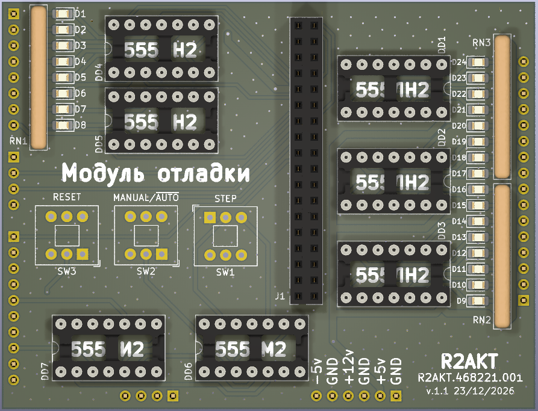

License addendum - https://github.com/R2AKT/Stepper/blob/main/Addendum.txt
# Stepper

Debug module. For Mega-80 (Mega-580) DIY 8-bit micro-computer - https://github.com/R2AKT/Mega-80.

Allows you to execute the program in step-by-step mode, displaying the states of the address and data buses.
Using the boot module, you can read and write data from/to memory - https://github.com/R2AKT/8080-5-CI.

Status: tested.

Модуль отладки. Для самодельной 8-битной микро-ЭВМ - https://github.com/R2AKT/Mega-80.

Позволяет выполнять программу в пошаговом режиме, с отображением состояний шины адреса и данных.
С помощью модуля загрузки позволяет считывать и записывать данные из/в память - https://github.com/R2AKT/8080-5-CI.

Статус: проверена.
